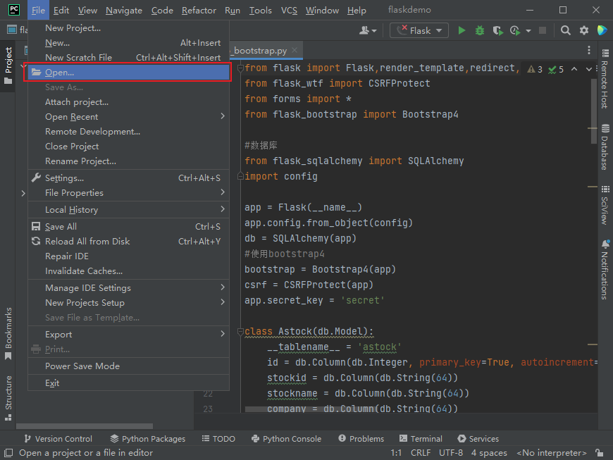
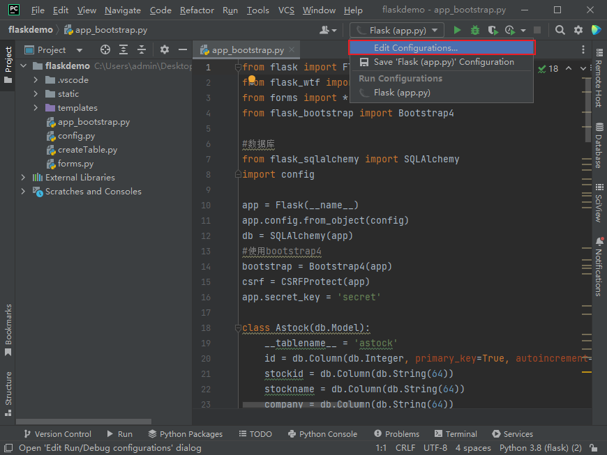
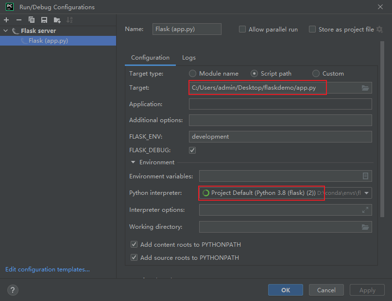
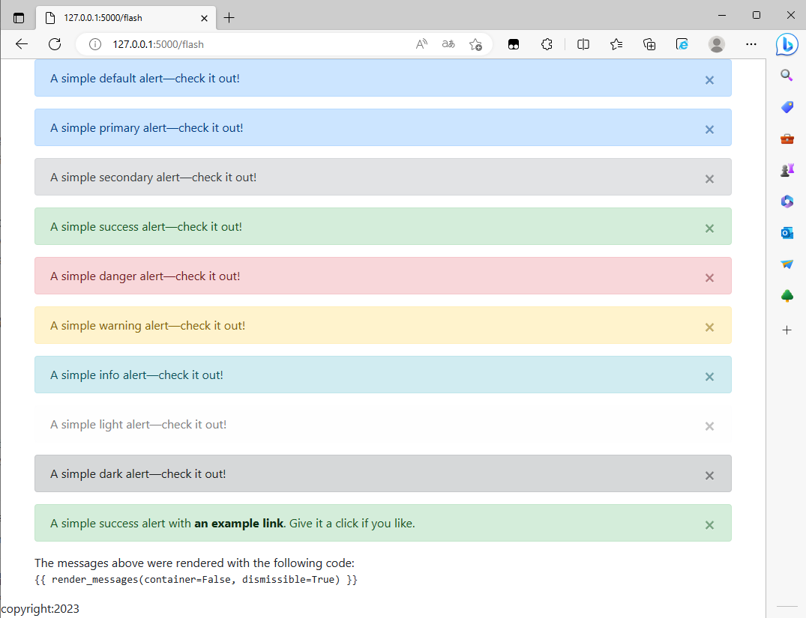
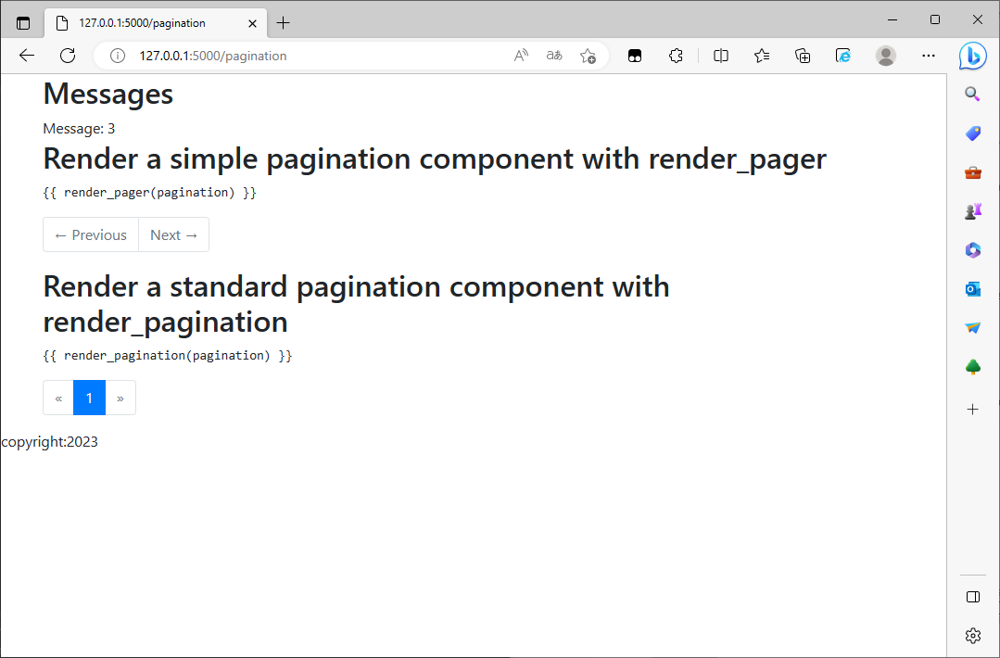
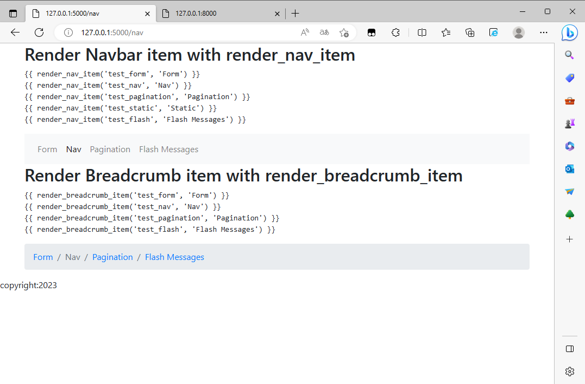
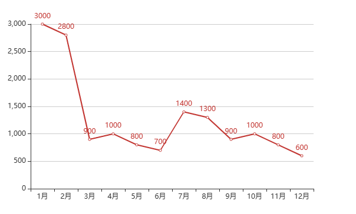

[toc]

### Flask案例

#### 简介

​	Flask是一个非常小的PythonWeb框架，被称为微型框架；只提供了一个稳健的核心，其他功能全部是通过扩展实现的；意思就是我们可以根据项目的需要量身定制，也意味着我们需要学习各种扩展库的使用。

#### 一、环境搭建

##### 1.1 canda常用命令

| 获取版本号                             | conda -V                                                     |
| -------------------------------------- | ------------------------------------------------------------ |
|                                        | conda --version                                              |
| 获取帮助                               | conda -h                                                     |
|                                        | conda --help                                                 |
| 获取环境相关命令的帮助                 | conda env -h                                                 |
| 所有 --单词 都可以用 -单词首字母来代替 | 比如 -version 可以用 -V来代替，只不过有的是大写，有的可能是小写 |

| 创建环境                             | conda create -n environment_name                        |
| ------------------------------------ | ------------------------------------------------------- |
| 创建指定python版本下包含某些包的环境 | conda create -n environment_name python=3.7 numpy scipy |
| 进入环境                             | conda activate environment_name                         |
| 退出环境                             | conda deactivate                                        |
| 删除环境                             | conda remove -n yourname --all                          |
| 列出环境                             | conda env list / conda info -e                          |
| 复制环境                             | conda create --name new_env_name --clone old_env_name   |
| 指定目录下生成环境yml文件            | conda env export > 目录/environment.yml                 |
| 从yml文件创建环境                    | conda env create -n env_name -f environment.yml         |

| 安装包                | conda instal package_name      |
| --------------------- | ------------------------------ |
| 查看当前环境包列表    | conda list                     |
| 查看指定环境包列表    | conda list -n environment_name |
| 查看conda源中包的信息 | conda search package_name      |
| 更新包                | conda update package_name      |
| 删除包                | conda remove package_name      |
| 清理无用的安装包      | conda clean -p                 |
| 清理tar包             | conda clean -t                 |
| 清理所有安装包及cache | conda clean -y --all           |
| 更新anaconda          | conda update annaconda         |

##### 1.2 创建虚拟环境

```conda
conda create -n flaskdemo python=3.8
```

##### 1.3 安装flask

```cmd
#进入flask虚拟环境
conda activate flaskdemo
#虚拟环境安装flask
pip install flask
```

##### 1.4 导入flaskdemo项目

- 打开flaskdemo项目

  

- 配置项目启动项

  

- 选择app文件和环境

  

#### 二、项目配置

##### 2.1 开启DEBUG

```python
#config.py
DEBUG='on'
```

##### 2.2 配置数据库连接参数

```python
#config.py
user = 'root' 
#数据库用户名
password = '123456'
#数据库密码
database = ''
#数据库名
host = '127.0.0.1'
#数据库ip
port = '3306'
#数据库端口
```

##### 2.3 安装项目依赖

```cmd
#安装python第三方库
pip install flask_sqlalchemy
pip install bootstrap_flask
pip install flask_wtf
```

##### 2.4 修改flaskdemo中的错误

```python
#app_bootstrap.py

#index函数
pagination = Astock.query.paginate(page=page, per_page=20)
#test_pagination函数
pagination = Astock.query.paginate(page=page, per_page=10)

#修改完成后即可运行项目，项目里面是bootstrap-flask的各种组件模板
```

#### 三、组件

​	这里基于flaskdemo里面的组件模板进行解释，了解更多请看[bootstrap-flask官方文档]([Bootstrap-Flask — Bootstrap-Flask 2.2.x 文档](https://bootstrap-flask.readthedocs.io/en/stable/))

​	了解更多bootstrap知识，请看[Bootstrap中文网 (bootcss.com)](https://www.bootcss.com/)

##### 3.1 flash

- flash组件用于消息的提醒，该demo中列举了许多例子如下图



- 在视图函数中可定义flash组件的样式

```python
#app_bootstrap.py
#flash组件模板视图
@app.route('/flash', methods=['GET', 'POST'])
def test_flash():
    #flash函数第一个参数是消息内容，第二个参数则是消息的类型(默认类型为primary)
    #消息的类型主要有primary、secondary、success、danger、warning、info、light、dark
    flash('A simple default alert—check it out!')
    flash('A simple primary alert—check it out!', 'primary')
    flash('A simple secondary alert—check it out!', 'secondary')
    flash('A simple success alert—check it out!', 'success')
    flash('A simple danger alert—check it out!', 'danger')
    flash('A simple warning alert—check it out!', 'warning')
    flash('A simple info alert—check it out!', 'info')
    flash('A simple light alert—check it out!', 'light')
    flash('A simple dark alert—check it out!', 'dark')
    #Markup函数使消息内部的HTML标签能够转义
    flash(Markup('A simple success alert with <a href="#" class="alert-link">an 		example link</a>. Give it a click if you like.'),'success')
    return render_template('bootstrap_flash.html')

```

- 模板文件加载flash

```python
#xxx.html

#dismissible是是否开启关闭按钮的选项
{{ render_messages(container=False, dismissible=True) }}
```

- 可关闭的flash组件

```python
#base.html
#因为base.html中只载入了bootstrap的css文件，需要在head中载入bootstrap的js文件后，点击消息的x按钮就可以关闭消息框
#导入js
{{ bootstrap.load_js() }}
#开启可关闭选项
{{ render_messages(container=False, dismissible=True) }}
```

##### 3.2 pagination

- 该demo列举了两种分页器样式



- 分页功能视图函数

```python
#app_bootstrap.py


@app.route('/pagination', methods=['GET', 'POST'])
def test_pagination():
    #定义一个变量page来获取前端翻页按钮传来的GET请求参数page
    page = request.args.get('page', 1, type=int)
    #对数据库对象Astock进行分页，page是页数，per_page是每一页的条数
    pagination = Astock.query.paginate(page=page, per_page=10)
    #获取分页后当前页的数据
    messages = pagination.items
    #将分页器对象和分页数据返回到模板
    return render_template('bootstrap_pagination.html', pagination=pagination, messages=messages)
```

- 分页器模板

```python
#xxx.html
#导入组件

#分页器样式一(只有上一页，下一页)
{{ render_pager(pagination) }}
#分页器样式二
{{ render_pagination(pagination) }}
```

##### 3.3 table

- 视图函数

```python
#app_bootstrap.py


@app.route('/table')
def test_table():
    #同分页器
    page = request.args.get('page', 1, type=int)
    pagination = Astock.query.paginate(page=page, per_page=20)
    messages = pagination.items
    #表格需要显示的字段名,格式为(数据库字段名,表格显示字段名)
    titles = [('id', '#'), ('stockid', '股票代码'), ('stockname', '股票名称'), ('company', '公司名称'), ('createtime', '上市时间'),('category', '行业分类'), ('desc', '主营业务')]
    #将数据、表头、数据库对象返回至前端模板
    return render_template('bootstrap_table.html', messages=messages, titles=titles, Astock=Astock)
```

- 表格模板

```python
#xxx.html
#导入组件

#判断是否有数据传入

#messages是后端查询到的表格数据，titles是表头，table_classes是表格的样式，show_actions是是否显示操作列，model是数据库模型，view_url是详细页按钮，参数格式为(视图函数名, [(请求参数名, :数据库字段名)])
{{ render_table(messages, titles, table_classes='table-responsive table-striped',
                    header_classes='thead-dark',
                    show_actions=True, model=Astock,
                    view_url=('view_message', [('message_id', ':stockid')])
                    )}}

```

##### 3.4 nav

* 该demo有两种nav



- 视图函数

```python
#app_bootstrap.py

@app.route('/nav', methods=['GET', 'POST'])
def test_nav():
    return render_template('bootstrap_nav.html')
```

- 导航模板

```html
#xxx.html
#导入组件


#bootstrap官网copy的样式
<nav class="navbar navbar-expand-lg navbar-light bg-light">
        <button class="navbar-toggler" type="button" data-toggle="collapse" data-target="#navbarSupportedContent"
                aria-controls="navbarSupportedContent" aria-expanded="false" aria-label="Toggle navigation">
            <span class="navbar-toggler-icon"></span>
        </button>
        <div class="collapse navbar-collapse" id="navbarSupportedContent">
            <div class="navbar-nav mr-auto">
                #导航栏子项，render_nav_item(视图函数, 显示名称)
                {{ render_nav_item('test_form', 'Form') }}
                {{ render_nav_item('test_nav', 'Nav') }}
                {{ render_nav_item('test_pagination', 'Pagination') }}
                {{ render_nav_item('test_flash', 'Flash Messages') }}
            </div>
        </div>
    </nav>
```

##### 3.5 form

- 表单类定义

```python
#form.py
#导包
from flask_bootstrap import SwitchField
from wtforms import Form, StringField,BooleanField,SubmitField, ValidationError,PasswordField
from flask_wtf import FlaskForm
from wtforms.fields import *
from wtforms.validators import DataRequired, Length, Regexp
#表单类需要继承FlaskForm
class ExampleForm(FlaskForm):
    #定义表单字段
    #description 添加字段描述
    #render_kw 可添加HTML属性(如class、id、placeholder等)
    date = DateField(description="We'll never share your email with anyone else.")  
    datetime = DateTimeField(render_kw={'placeholder': 'this is a placeholder'})  
    datetime_local = DateTimeLocalField()
    time = TimeField()
    floating = FloatField()
    integer = IntegerField()
    decimal_slider = DecimalRangeField()
    
    integer_slider = IntegerRangeField(render_kw={'min': '0', 'max': '4'})
    email = EmailField()
    url = URLField()
    search = SearchField()
    telephone = TelField()
    #validators 设置验证属性
    image = FileField(render_kw={'class': 'my-class'}, validators=[Regexp('.+\.jpg$')]) 
    #choices 添加表单元素的可选项
    option = RadioField(choices=[('dog', 'Dog'), ('cat', 'Cat'), ('bird', 'Bird'), ('alien', 'Alien')])
    select = SelectField(choices=[('dog', 'Dog'), ('cat', 'Cat'), ('bird', 'Bird'), ('alien', 'Alien')])
    select_multiple = SelectMultipleField(choices=[('dog', 'Dog'), ('cat', 'Cat'), ('bird', 'Bird'), ('alien', 'Alien')])
    bio = TextAreaField()
    title = StringField()
    secret = PasswordField()
    remember = BooleanField('Remember me')
    submit = SubmitField()
```

- 表单模板

```python
#xxx.html

#render_form 直接打印整个表单，有三个常用参数(表单模型,处理url,请求方法)
{{ render_form(form,'/form','get') }}
#表示用get请求的方式将表单传递给/form路由对于的视图函数处理
#render_field打印单个表单元素
{{ render_field(form.username) }}
#render_form_row打印一行表单元素
{{ render_form_row([form.username, form.password]) }}
```

- 表单视图

```python
#app_bootstrap.py

@app.route('/form', methods=['GET', 'POST'])
def test_form():
    form = HelloForm()
    #验证表单
    if form.validate_on_submit():
        flash('Form validated!')
        #通过验证则返回index路由
        return redirect(url_for('index'))
    return render_template(
        'bootstrap_form.html',
        #返回表单对象到模板
        form=form,
        telephone_form=TelephoneForm(),
        contact_form=ContactForm(),
        im_form=IMForm(),
        button_form=ButtonForm(),
        example_form=ExampleForm()
    )
```

##### 3.6 搜索框

- 表单对象

```python
class Search(FlaskForm):
    LIST=[('','不限'),
     ('A','A'),
     ('B','B'),
     ('C','C'),
     ('D','D'),
     ('E','E'),
        ]
    grade=SelectField(render_kw={'class': 'grade'},choices=LIST)
    name=SearchField(render_kw={'class': 'name','placeholder':'企业名'})
    查询 = SubmitField()
```

- 视图函数

```python
#app.py
   
@app.route('/', methods=['GET', 'POST'])
def index():
    #获取查询对象
    company=companyInfo.query
    if request.method=='GET':
        s=Search(request.args)
        name=request.args.get('name','')
        grade=request.args.get('grade','')
    else:
        s=Search(request.form)
        name=request.form.get('name','')
        grade = request.form.get('grade','')
    if grade!='':
            company=company.filter(companyInfo.等级==grade)
    if name!='':
            company=company.filter(companyInfo.name.like(f'%{name}%'))
    #分页
    page = request.args.get('page', 1, type=int)
    pagination = company.paginate(page=page, per_page=20)
    messages = pagination.items
    #表头
    titles = [ ('id', '#'),('name', '企业名'), ('法人', '法人'), ('类型', '类型'), ('等级', '等级')]
    return render_template('index.html', pagination=pagination, messages=messages, companyInfo=companyInfo, titles=titles,Search=s,name=name,grade=grade)
```

- 模板

```python

{{ render_form(Search,'/') }}
```

#### 四、Ajax

##### 4.1 定义

​	异步 JavaScript 和 XML，或 Ajax 本身不是一种技术，而是一种将一些现有技术结合起来使用的方法，包括：HTML 或 XHTML、CSS、JavaScript、DOM、XML、XSLT、以及最重要的 XMLHttpRequest 对象。当使用结合了这些技术的 Ajax 模型以后，网页应用能够快速地将增量更新呈现在用户界面上，而不需要重载（刷新）整个页面。这使得程序能够更快地回应用户的操作。

​	尽管 Ajax 中的 X 代表 XML，但是 JSON 才是首选，因为它更加轻量，而且是用 JavaScript 编写的。在 Ajax 模型中，JSON 和 XML 都被用来包装信息。


##### 4.2 jQuery Ajax语法

```javascript
$.ajax({name:value, name:value, ... })
```

##### 4.3 jQuery Ajax函数参数

| 名称                         | 值/描述                                                      |
| :--------------------------- | :----------------------------------------------------------- |
| async                        | 布尔值，表示请求是否异步处理。默认是 true。                  |
| beforeSend(*xhr*)            | 发送请求前运行的函数。                                       |
| cache                        | 布尔值，表示浏览器是否缓存被请求页面。默认是 true。          |
| complete(*xhr,status*)       | 请求完成时运行的函数（在请求成功或失败之后均调用，即在 success 和 error 函数之后）。 |
| contentType                  | 发送数据到服务器时所使用的内容类型。默认是："application/x-www-form-urlencoded"。 |
| context                      | 为所有 AJAX 相关的回调函数规定 "this" 值。                   |
| data                         | 规定要发送到服务器的数据。                                   |
| dataFilter(*data*,*type*)    | 用于处理 XMLHttpRequest 原始响应数据的函数。                 |
| dataType                     | 预期的服务器响应的数据类型。                                 |
| error(*xhr,status,error*)    | 如果请求失败要运行的函数。                                   |
| global                       | 布尔值，规定是否为请求触发全局 AJAX 事件处理程序。默认是 true。 |
| ifModified                   | 布尔值，规定是否仅在最后一次请求以来响应发生改变时才请求成功。默认是 false。 |
| jsonp                        | 在一个 jsonp 中重写回调函数的字符串。                        |
| jsonpCallback                | 在一个 jsonp 中规定回调函数的名称。                          |
| password                     | 规定在 HTTP 访问认证请求中使用的密码。                       |
| processData                  | 布尔值，规定通过请求发送的数据是否转换为查询字符串。默认是 true。 |
| scriptCharset                | 规定请求的字符集。                                           |
| success(*result,status,xhr*) | 当请求成功时运行的函数。                                     |
| timeout                      | 设置本地的请求超时时间（以毫秒计）。                         |
| traditional                  | 布尔值，规定是否使用参数序列化的传统样式。                   |
| type                         | 规定请求的类型（GET 或 POST）。                              |
| url                          | 规定发送请求的 URL。默认是当前页面。                         |
| username                     | 规定在 HTTP 访问认证请求中使用的用户名。                     |
| xhr                          | 用于创建 XMLHttpRequest 对象的函数。                         |

##### 4.4 基本Ajax请求方法

```javascript
$.ajax({
        url: '接口url',
        dataType: "返回数据格式",
        type: "请求方法",
        success: function (data) {
           .....
        },
        error: function (err) {
           .....
        }
     })
```


#### 五、echarts

​	ECharts，一个使用 JavaScript 实现的开源可视化库，可以流畅的运行在 PC 和移动设备上，兼容当前绝大部分浏览器（IE9/10/11，Chrome，Firefox，Safari等），底层依赖矢量图形库 ZRender，提供直观，交互丰富，可高度个性化定制的数据可视化图表。

​	官网[Apache ECharts](https://echarts.apache.org/zh/index.html)

##### 5.1 简单demo

- HTML代码

```html
<!DOCTYPE html>
<html lang="en">
<head>
    <meta charset="UTF-8">
    #导入jquery和echarts的js文件
    <script src="../static/js/jquery-1.11.1.min.js"></script>
    <script src="../static/js/echarts.min.js"></script>
</head>
<body>
#width和height必须设置
<div style="width: 600px;height: 400px"></div>
<script>
    #初始化图表对象，图表载入至div
    var mCharts = echarts.init(document.querySelector("div"))
    var xData = ['1月', '2月', '3月', '4月', '5月', '6月', '7月', '8月', '9月', '10月', '11月', '12月']
    var yData = [3000, 2800, 900, 1000, 800, 700, 1400, 1300, 900, 1000, 800, 600]
    #配置图表
    var option = {
        xAxis:{
            type:'category',
            data:xData
        },
        yAxis:{
            type:'value'
        },
        series:[
            {
                type:'line',
                data:yData,
                label:{show:true,rotate:0}
            }
        ]
    }
    #显示图表
    mCharts.setOption(option)
</script>
</body>
</html>

```

- 效果



##### 5.2 Echarts结合flask

- 视图函数

```python
@app.route('/chart', methods=['GET', 'POST'])
def test_chart():
    xdata= ['1月', '2月', '3月', '4月', '5月', '6月', '7月', '8月', '9月', '10月', '11月', '12月']
    ydata=[3000, 2800, 900, 1000, 800, 700, 1400, 1300, 900, 1000, 800, 600]
    return render_template('echarts.html',xdata=xdata,ydata=ydata)
```

- 模板

```html
<!DOCTYPE html>
<html lang="en">
<head>
    <meta charset="UTF-8">
    #导入jquery和echarts的js文件
    <script src="../static/js/jquery-1.11.1.min.js"></script>
    <script src="../static/js/echarts.min.js"></script>
</head>
<body>
#width和height必须设置
<div style="width: 600px;height: 400px"></div>
<script>
    #初始化图表对象，图表载入至div
    var mCharts = echarts.init(document.querySelector("div"))
    #模板获取后端数据
    var xData = {{xdata |tojson}}
    var yData = {{ydata |tojson}}
    
    #配置图表
    var option = {
        xAxis:{
            type:'category',
            data:xData
        },
        yAxis:{
            type:'value'
        },
        series:[
            {
                type:'line',
                data:yData,
                label:{show:true,rotate:0}
            }
        ]
    }
    #显示图表
    mCharts.setOption(option)
</script>
</body>
</html>
```

##### 5.3 Echarts结合Ajax

- 视图函数

```python
#后端设计api，返回json数据
@app.route('/api/analysis', methods=['GET', 'POST'])
def analysis():
    data={}
    try:
        data['list']=[]
        #这里有A、B、C、D、E五个等级，分别获取每个等级的企业数量
        for i in ['A','B','C','D','E']:
            data['list'].append({'count':companyInfo.query.filter(companyInfo.等级==i).count(),'等级':i})
        status=200
        msg='success'
    except Exception as e:
        status=500
        msg=f'{e}'
    datas={'data':data,'status':status,'msg':msg}
    return jsonify(datas)
```

- 接口返回的数据

```json
{
  "data": {
    "list": [
      {
        "count": 161246,
        "等级": "A"
      },
      {
        "count": 20809,
        "等级": "B"
      },
      {
        "count": 237,
        "等级": "C"
      },
      {
        "count": 3558,
        "等级": "D"
      },
      {
        "count": 108,
        "等级": "E"
      }
    ]
  },
  "msg": "success",
  "status": 200
}
```

- js代码

```javascript
//该处代码利用Ajax访问后端接口获取数据，获取成功就调用echarts进行绘图
$.ajax({
        url: '/api/analysis',
        dataType: "text",
        type: "get",
        success: function (data) {
           //将data解析为json对象(相当于python中的字典)
           var data=JSON.parse(data)['data']['list']
           var myChart = echarts.init(document.querySelector('#analysis'));
           option = {
              //表名
              title: {
                 text: '评级分布图'
             },
              legend: {
                 top: 'bottom'
              },
              tooltip: {
                 trigger: 'item',
                 formatter: '{a} <br/>{b} : {c} ({d}%)'
               },
              toolbox: {
                 show: true,
                 feature: {
                    mark: { show: true },
                    dataView: { show: true, readOnly: false },
                    restore: { show: true },
                    saveAsImage: { show: true }
                 }
              },
              series: [
                 {
                    name: '评级分布',
                    type: 'pie',
                    radius: [70, 150],
                    center: ['50%', '50%'],
                    roseType: 'area',
                    itemStyle: {
                       borderRadius: 8
                    },
                    //将api获取的数据填入
                    data: [
                       { value: data[0]['count'], name: data[0]['等级'] },
                       { value: data[1]['count'], name: data[1]['等级'] },
                       { value: data[2]['count'], name: data[2]['等级'] },
                       { value: data[3]['count'], name: data[3]['等级'] },
                       { value: data[4]['count'], name: data[4]['等级'] },
                    ]
                 }
              ]
           };
           //显示图表
           myChart.setOption(option);
        },
        error: function (err) {
           
        }
     })
```

- 效果


